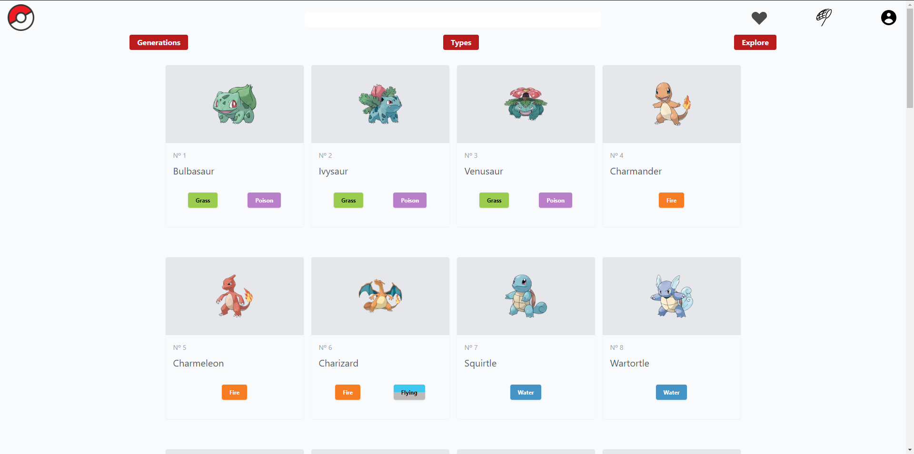
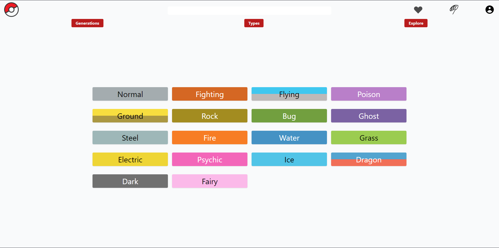
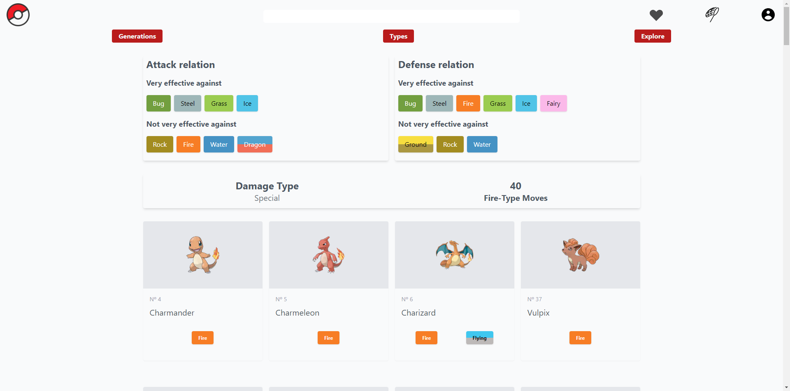
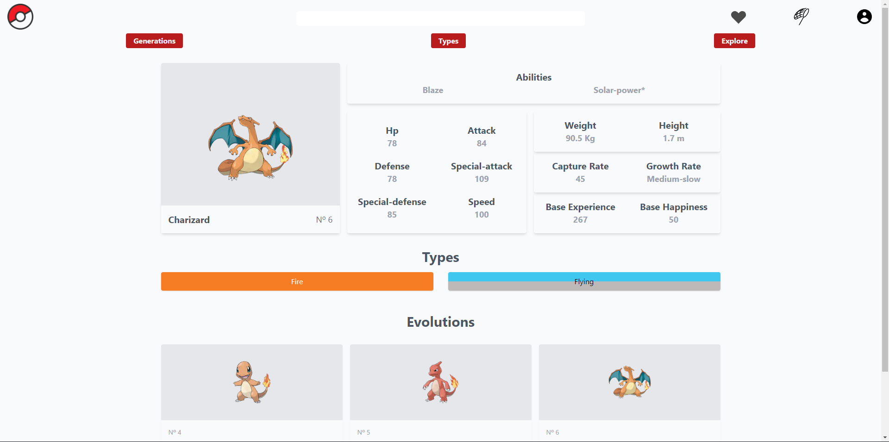

# Pokedex App v2
O Pokedex App v2 é a versão melhorada do meu primeiro projeto em Rect.js, foi construída na intenção de praticar a criação de um projeto Full-Stack utilizando o Back-end como serviço (_BaaS_).

## Table de Conteúdos

- [Visão geral](#visão-geral)
  - [O desafio](#o-desafio)
  - [Imagens](#imagens)
  - [Links](#links)
- [Meu processo](#meu-processo)
  - [Construído com](#construído-com)
  - [O que aprendi](#o-que-aprendi)
  - [Recursos úteis](#recursos-úteis)
- [Autor](#autor)

## Visão geral

### O desafio

Esse projeto foi pensado para praticar e aprofundar meus conhecimento no Next.js, utilizando esse Framework não apenas como ferramenta para o Front-end, mas também para o Back-end.

Apesar de ser uma aplicação Full-Stack, ela não possui Back-end próprio, ao invés disso utiliza os serviços do Firebase. Optei por esse caminho com o objetivo de acelerar o desenvolvimento do projeto e poder _"brincar"_ com uma nova ferramenta.

__Os usuários devem ser capaz de?__
- Autenticar-se
- Visualizar pokemons com scroll infinito
- Buscar pokemons por tipo
- Visualizar os detalhes de cada pokemon
- Salvar seus pokemons favoritos

### Imagens

<small>Página principal</small>

<small>Busca por tipo</small>

<small>Pokemons por tipo</small>

<small>Detalhes dos pokemons</small>

### Links

- Site online: https://pokedex-app-v2-liart.vercel.app

## Meu processo

### Construído com

- TypeScript
- Rect.js
- Next.js
- Context API
- React Hooks
- Styled-Components
- Tailwind CSS
- Firebase - _FireStore_ e _Auth_

### O que aprendi

Nesse projeto pude aprofundar meus conhecimentos sobre Next.js, mais especificamente em relação as diferentes gerações de páginas, além disso consegui aprender do zero uma nova ferramente, o Firebase no caso.

### Recursos úteis

- [RocketSeat - Next do zero](https://www.youtube.com/watch?v=2LS6rP3ykJk&t=3595s)
- [Documentação Next](https://nextjs.org)
- [Documentação Firebase](https://firebase.google.com/docs?authuser=0&hl=pt)

## Autor

- LinkedIn - [Gabriel Silvestre](https://www.linkedin.com/in/gabrielh-silvestre/)
- DevTo - [Gabriel_Silvestre](https://dev.to/gabrielhsilvestre)
